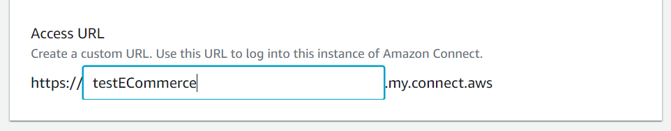
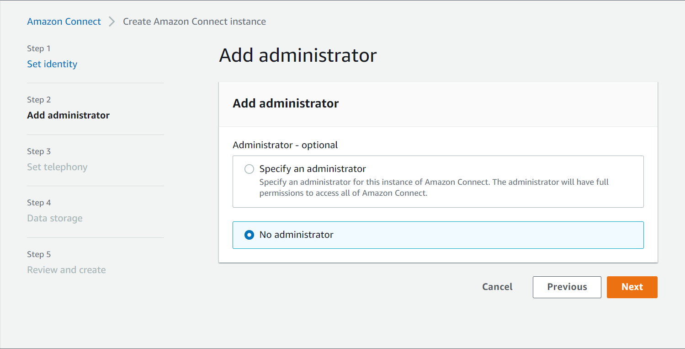
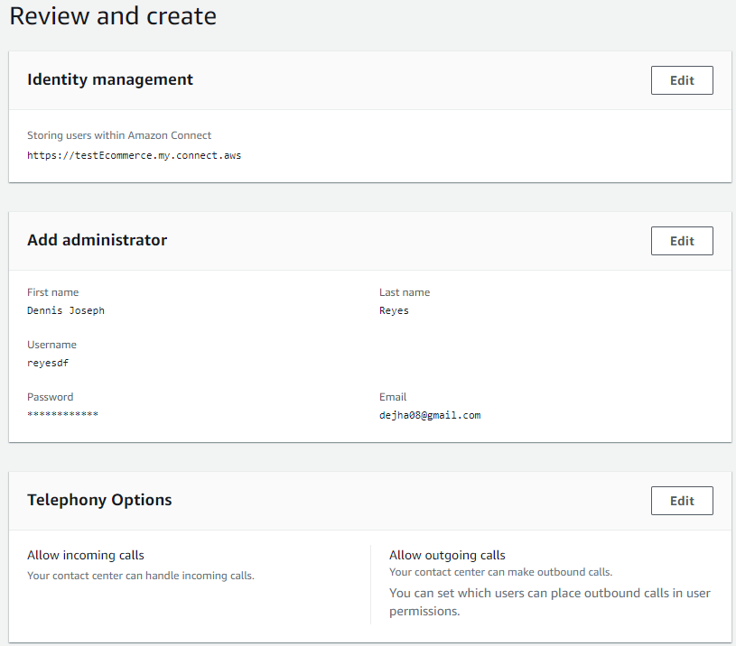
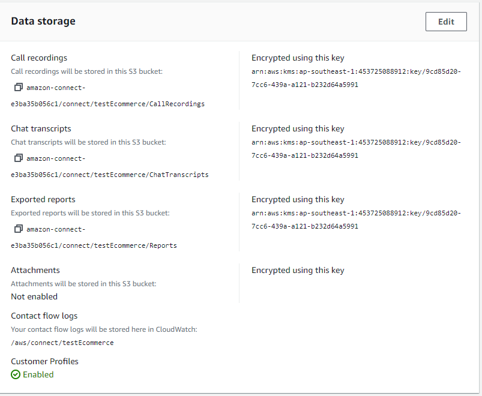
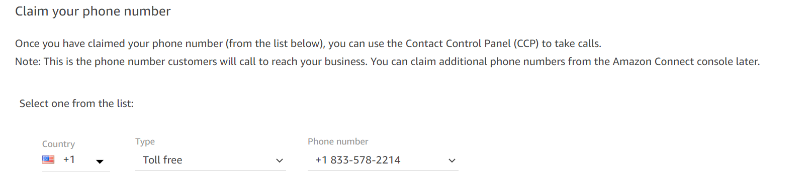

# Amazon Connection

[amazon connect documentation](https://aws.amazon.com/connect/)
[aws skill builder](https://explore.skillbuilder.aws/learn/course/1488/play/41582/aws-partner-amazon-connect-technical-english)

## Setup

after creating AWS Cloud account

### Set Identity

1. Search Amazon Connect
2. Create Instance
3. Set Identity
   1. Select `Store Users in Amazon Connect`.
   2. Enter unique string in `Access URL` field.
   

### Administration

You can create an admin using the create account, for now we can skip this step

### Telephony

Users can use the web provided telephones by aws or desk phones using the `public switched telephone network | pstn`

### Data storage

Calls with customers are stored in the s3 bucket and encryped with AWS key service

### Review and Change

Last step in creatin the AWS Connect instance is to review and make necessary changes to your config. you can also note your config for future reference.

`remember: you cannot change the identity management after you create the instance`

## Configure your Contact Center

### Claim Phone Number

It will depend on what phone you will be using and where you are located, for testing, we used US for country, Toll Free for Type and select any phone number on the Number field.

### Port a Number

1. Go To Support Center
2. Create a suport case
   1. Choose `Service Limit Increase`
   2. Limit Type
      1. Amazon Connect
   3. Get Service ARN
      1. Services -> Amazon Connect -> Instance Name -> Copy Instance ARN
3. Paste ARN in support case screen
4. For the Request
   1. Region
   2. Limit : Phone Number Porting
   3. New Limit Value: your phone number
5. Case Description: you need to port your phone number to your amazon connect contact center
6. 2 - 4 weeks ETA

### Set up Hours of Operation

