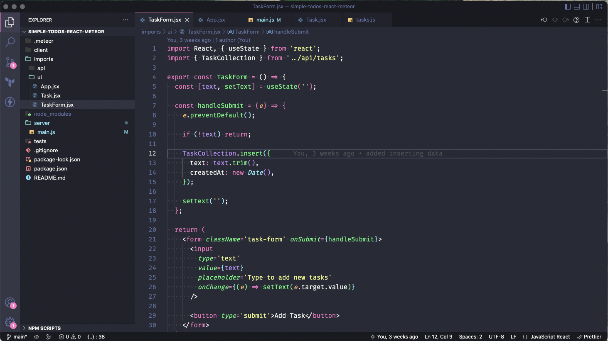

# Creating an App with Meteor and React

sample repository: [meteorTodo](https://github.com/reyesdf/meteorTodo)

**Creating Meteor Project**: `meteor create name_of_app-react`
**To run app:** `meteor run`

*you can also omit the ==--react== option since it is the default.*

## Sample Folder Structure



You will be focusing more on the `imports` folder. `api` folder is for the apis that you will be creating and `ui` will be for the components.

## Collections

Meteor uses MongoDB as default databse. to use the database feature, we will create a *[collection](https://guide.meteor.com/collections.html)*.

To add/create a collection, create a new file in the `api` folder and export it:

`imports/api/TasksCollection.js`

```Javascript
import {Mongo} from meteor/mongo;
export const TasksCollection = new Mongo.Collection('task)'
```

Initialize Tasks Collection

importing collection:
`import "imports/api/TasksCollection"` or `import {TasksCollection} from "/imports/api/TasksCollection`

sample code on `server/main.js`

```Javascript
import { Meteor } from 'meteor/meteor';
import { TasksCollection } from '/imports/api/TasksCollection';

const insertTask = taskText => TasksCollection.insert({ text: taskText });

Meteor.startup(() => {
  if (TasksCollection.find().count() === 0) {
    [
      'First Task',
      'Second Task',
      'Third Task',
      'Fourth Task',
      'Fifth Task',
      'Sixth Task',
      'Seventh Task'
    ].forEach(insertTask)
  }
});
```

you are now importing the TasksCollection and it has a few tasks that you can iterate in the ui.

## Methods

The easiest way to make changes in the server safely is by declarin `methods`. Instead of calling `insert`, `update`, or `remove` directly in the client (front end side of the app).

Meteor Method is a way to communicate with your server using the function `Meteor.call`, you need to provide the name of your method and the arguments it accepts.

Used to save user input events and data that come from the client.

